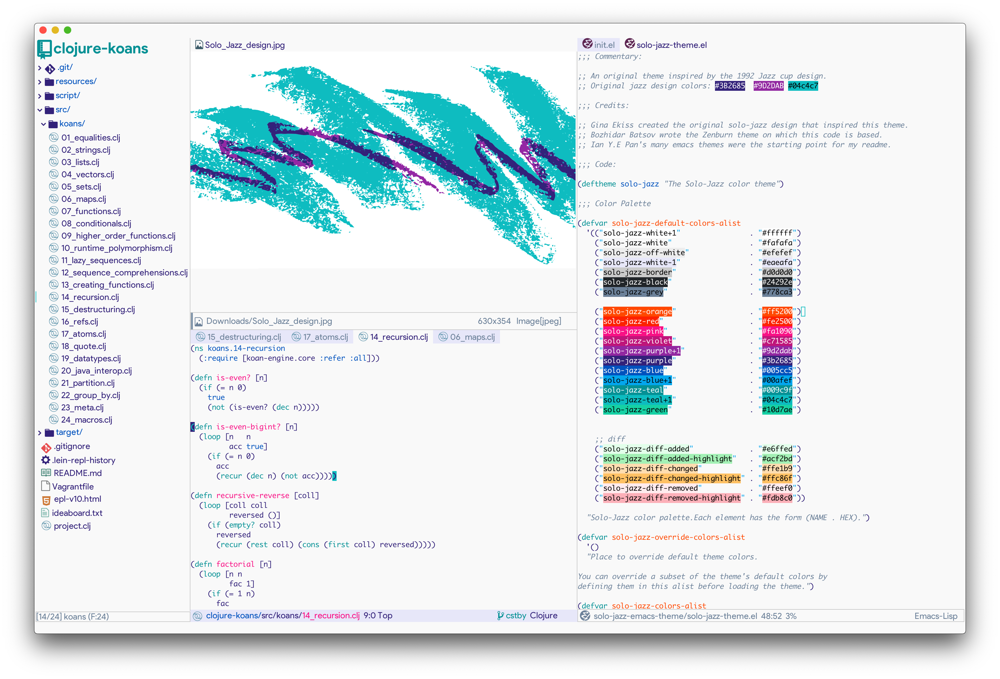

<h1 align="center">Solo Jazz Theme for Emacs</h1>

<p align="center">

</p>
<p align="center">
<a href="https://github.com/cstby/solo-jazz-emacs-theme"></a>
<a href="https://github.com/cstby/solo-jazz-emacs-theme"></a>
<a href="https://melpa.org/#/solo-jazz-theme"></a>
<a href="https://www.gnu.org/software/emacs/"></a>
<a href="https://www.gnu.org/licenses/gpl-3.0"></a>
</p>

<br/>

<p align="center">An original theme inspired by the 1992 Solo Jazz cup design.</p>

<br/>

## About

Inspired by the [Jazz](https://en.wikipedia.org/wiki/Jazz_(design)) design, this eye-pleasing theme fits into any modern day work environment while tastefully showcasing a late 20th century aesthetic.



## Installation

### MELPA (recommended)

You can install this theme with the following `package.el` command:
`M-x package-install solo-jazz-theme`

Or if you have `use-package`, simply add this declaration to your `init.el`:
``` elisp
(use-package solo-jazz-theme
  :ensure t
  :config
  (load-theme 'solo-jazz t))
```

### Manual

Download `solo-jazz-theme.el` and put it under `~/.emacs.d/themes/`, then add these lines to your `init.el`:

```emacs-lisp
(add-to-list 'custom-theme-load-path "~/.emacs.d/themes/")
(load-theme 'solo-jazz t)
```

## Supported Modes

- avy
- centaur-tabs
- company
- cider
- doom-modeline
- diff
- dired
- ediff
- ido
- isearch
- ivy (counsel and projectile)
- hl-line
- keycast
- magit
- line numbers
- lispy
- magit
- markdown
- neotree
- org mode
- post-tip
- show-paren
- racket
- undo-tree
- web-mode
- whitespace-mode

## Rainbow Mode

If you would like to modify the theme, you may find it useful to see the colors directly. You can do so using rainbow mode by executing the following.

``` elisp
(advice-add 'rainbow-turn-on :after  #'solo-jazz-theme-rainbow-turn-on)
(advice-add 'rainbow-turn-off :after #'solo-jazz-theme-rainbow-turn-off)
```

Toggling rainbow-mode inside the `solo-jazz-theme.el` will colorize all solo-jazz color names wherever they appear in that buffer.

## Contributing

Please feel free to send a GitHub pull request to add support for your favorite packages. If you find any bugs or problems, please report them in the issue tracker. I welcome contributions of any kind.

## License

Distributed under the GNU General Public License, version 3.
